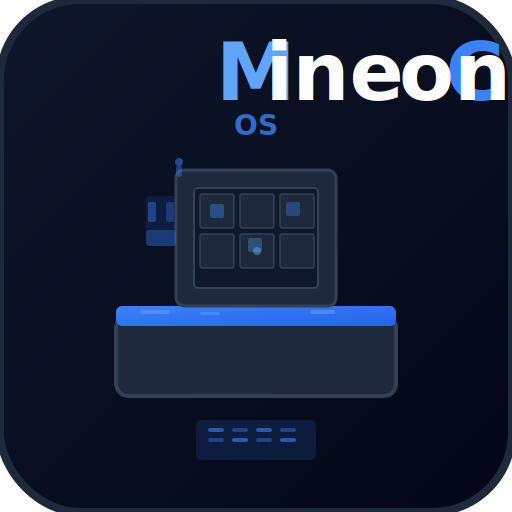

# MineControl OS

> Self-hosted Minecraft server management platform with web dashboard, desktop app, and real-time monitoring.



## Features

- **Full Server Control** — Start, stop, restart your PaperMC server from the dashboard or system tray
- **Live Console** — Real-time command-line interface with log searching and filtering
- **Player Management** — Track players, manage roles (Owner/Admin/Moderator/Member), ban/kick/mute
- **World Manager** — Create, clone, download, and upload Minecraft worlds
- **Plugin Manager** — Install/remove/enable/disable plugins, quick-install popular ones
- **Backup System** — Auto and manual backups with encryption, local storage
- **Real-Time Monitoring** — CPU, RAM (MC + system), TPS, disk usage, player count
- **Notification System** — Alerts for player joins/leaves, server events, crashes
- **Resource Dashboard** — Charts for system resources and performance over 30 minutes
- **Electron Desktop App** — Installable native app for Windows, macOS, and Linux

## Quick Start

### Prerequisites

- **Java 17 or 21** — [Download](https://adoptium.net/)
- **Node.js 18+** — [Download](https://nodejs.org/)
- **8GB+ RAM** recommended

### Installation

```bash
# 1. Clone or download
git clone https://github.com/Harsha240105/Mine-Control.git
cd MineControlOS

# 2. Install dependencies
npm install

# 3. Download PaperMC server jar (1.21.1)
#    Place it at: minecraft/server.jar
#    Or run:
curl -L -o minecraft/server.jar https://api.papermc.io/v2/projects/paper/versions/1.21.1/builds/133/downloads/paper-1.21.1-133.jar

# 4. Start development
npm run dev
```

### Login

| Username | Password |
|----------|----------|
| `owner`  | `minecraft` |

**Change the password immediately after first login!**

### Access

- **Web UI:** http://localhost:5173 (dev) or http://localhost:3001 (production)
- **API:** http://localhost:3001/api
- **Minecraft Server:** `localhost:25565`

## How Players Connect

### Friends with official Minecraft launcher (premium)

1. Make sure your computer is **on the same network** as your friends, or **port-forward** port `25565` on your router
2. Your friends open Minecraft Java Edition → **Multiplayer** → **Add Server**
3. Enter your **local IP** (e.g., `192.168.1.100`) or **public IP** if port-forwarding
4. They join — the server automatically whitelists them (or you pre-add them in the Players page)

### Friends with TLauncher / cracked launcher

1. In Settings → set **Online Mode** to `false` (this disables Mojang authentication)
2. Restart the Minecraft server
3. Friends connect using your IP as above
4. **Warning:** This is less secure — anyone can join with any username

### Port Forwarding (for friends outside your network)

1. Find your **local IP**: run `ipconfig` (Windows) and look for `IPv4 Address`
2. Log into your **router admin panel** (usually http://192.168.1.1)
3. Find **Port Forwarding** section
4. Add rule: External port `25565` → Internal IP (your local IP) → Internal port `25565` → TCP
5. Give friends your **public IP** (search "what is my IP" on Google)

## Desktop App (Installable)

Build the native installer for your OS:

### Windows

```bash
npm run build:desktop:win
# Output: dist/release/MineControl OS-Setup-1.0.0-x64.exe
```

### macOS

```bash
npm run build:desktop:mac
# Output: dist/release/MineControl OS-1.0.0-x64.dmg
```

### Linux

```bash
npm run build:desktop:linux
# Output: dist/release/MineControl OS-1.0.0-x64.AppImage
```

### Development (Electron)

```bash
npm run dev:electron
```

## Project Structure

```
MineControlOS/
├── electron/          # Electron desktop app
│   ├── main.ts        # Main process (window, tray, menus)
│   └── preload.ts     # Context bridge for IPC
├── server/            # Express.js backend
│   ├── index.ts       # Entry point
│   ├── routes/        # API routes (auth, server, players, worlds, plugins, backups)
│   ├── services/      # Minecraft server manager, backup service
│   ├── middleware/     # JWT auth, role-based permissions
│   └── database.ts    # SQLite schema and connection
├── src/               # React frontend (Vite + TypeScript)
│   ├── pages/         # Dashboard, Players, Console, Worlds, Plugins, Backups, Settings
│   ├── components/    # Layout, NotificationPanel
│   ├── hooks/         # useAuth, useSocket, useNotifications
│   └── lib/           # API client
├── minecraft/         # Minecraft server directory
│   ├── server.jar     # PaperMC server jar
│   ├── plugins/       # Server plugins
│   ├── worlds/        # World data
│   └── backups/       # Local backups
├── data/              # SQLite database
└── public/            # Static assets (logos, favicon)
```

## Screenshots

> *Coming soon — run the app and see for yourself!*

| Dashboard | Console | Players |
|-----------|---------|---------|
| Resource metrics, charts, server status | Live command-line with search/filter | Role management, ban/kick/mute |

## Tech Stack

| Layer | Technology |
|-------|-----------|
| Frontend | React 18, TypeScript, Vite, Tailwind CSS, Recharts |
| Backend | Node.js, Express, Socket.IO |
| Database | SQLite (better-sqlite3) |
| Desktop | Electron, electron-builder |
| Minecraft | PaperMC 1.21.1 |

## API Overview

| Method | Endpoint | Description |
|--------|----------|-------------|
| POST | `/api/auth/login` | Login |
| GET | `/api/server/status` | Server status + system resources |
| POST | `/api/server/start` | Start server |
| POST | `/api/server/stop` | Stop server |
| POST | `/api/server/restart` | Restart server |
| GET | `/api/server/logs` | Get logs |
| POST | `/api/server/command` | Send command |
| GET | `/api/players` | List players |
| GET | `/api/backups` | List backups |
| GET | `/api/plugins` | List plugins |
| GET | `/api/worlds` | List worlds |

Full API docs: [docs/API.md](docs/API.md)

## Plugins

Popular plugins can be installed from the Plugins page with one click:

- **LuckPerms** — Advanced permissions system
- **EssentialsX** — Essential server commands
- **WorldEdit** — In-game world editing
- **Vault** — Economy/permissions API
- **ClearLag** — Lag reduction
- **CoreProtect** — Block logging and rollback

To add custom plugins, either:
1. Use the **Install Plugin** form with a download URL
2. Drop `.jar` files into `minecraft/plugins/` and restart the server

## Maps / Worlds

- **Create** new worlds with custom seed, gamemode, and difficulty
- **Clone** existing worlds
- **Download** worlds as `.zip` files
- **Upload** world `.zip` files
- Worlds are stored in `minecraft/worlds/`

## Configuration

Edit server settings from the Settings page:
- Server name (MOTD), max players, difficulty, gamemode
- PvP on/off, whitelist, auto-restart, auto-backup
- Port, view distance, RAM allocation
- Java path and JAR file

## Development

```bash
# Run both server and client with hot reload
npm run dev

# Run only server
npm run dev:server

# Run only client
npm run dev:client

# Build for production
npm run build

# Type check
npm run typecheck
```

## License

MIT

---

*Built with ❤️ for the Minecraft community*
